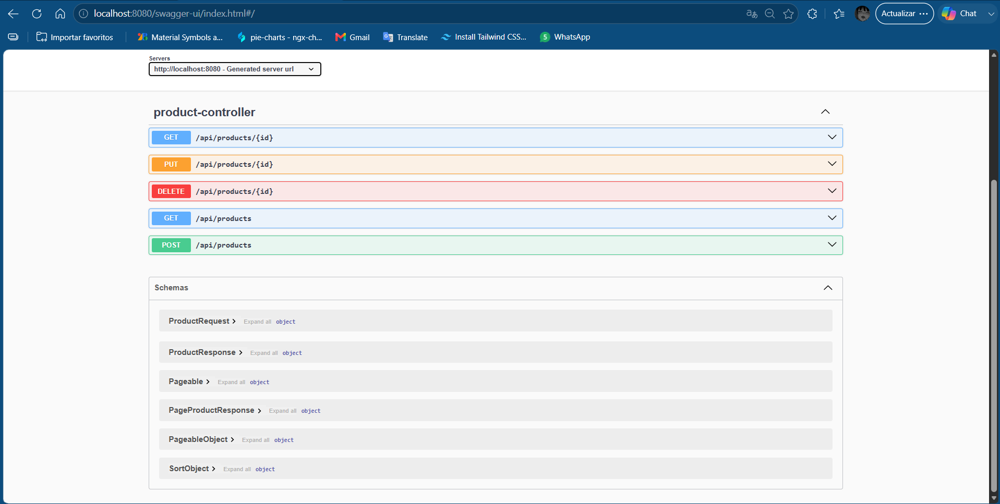
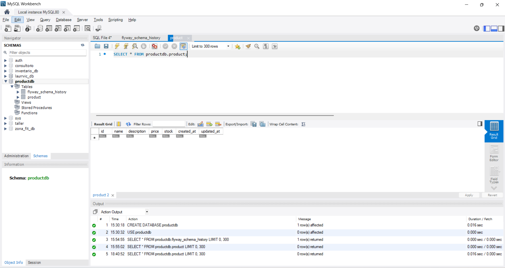

# 🚀 Product API

API REST desarrollada con **Spring Boot 3** para la gestión de productos.

Implementa operaciones **CRUD**, validación de datos, migraciones con **Flyway**, documentación automática mediante **Swagger/OpenAPI** y pruebas unitarias e integración siguiendo una arquitectura en capas.

---

## 📸 Vista previa

### Swagger UI



### Base de datos (MySQL)



---

## 🛠️ Tecnologías utilizadas

- Java 17
- Spring Boot 3
- Spring Data JPA
- MySQL 8
- Flyway
- Maven
- Jakarta Validation
- OpenAPI / Swagger
- JUnit 5
- Mockito
- MockMvc
- Lombok

---

## ✨ Funcionalidades

- Crear un producto
- Consultar un producto por ID
- Listar productos con paginación
- Actualizar un producto
- Eliminar un producto
- Validación de datos
- Manejo global de excepciones
- Migraciones automáticas con Flyway
- Documentación interactiva con Swagger
- Pruebas unitarias e integración

---

## 🏗️ Arquitectura

```
                HTTP Request
                     │
                     ▼
              ProductController
                     │
                     ▼
              ProductService
                     │
                     ▼
            ProductRepository
                     │
                     ▼
                MySQL Database
```

El proyecto sigue una arquitectura en capas para separar responsabilidades, facilitar el mantenimiento y mejorar la escalabilidad.

---

## 📂 Estructura del proyecto

```
src
├── controller
├── service
├── repository
├── entity
├── dto
├── mapper
├── exception
├── config
└── resources
```

---

## 📌 Endpoints

| Método | Endpoint | Descripción |
|---------|----------|-------------|
| POST | `/api/products` | Crear producto |
| GET | `/api/products` | Listar productos |
| GET | `/api/products/{id}` | Obtener producto por ID |
| PUT | `/api/products/{id}` | Actualizar producto |
| DELETE | `/api/products/{id}` | Eliminar producto |

---

## 🗄️ Base de datos

Crear una base de datos llamada:

```sql
CREATE DATABASE productdb;
```

Configurar las credenciales en:

```
src/main/resources/application.properties
```

Ejemplo:

```properties
spring.datasource.url=jdbc:mysql://localhost:3306/productdb
spring.datasource.username=TU_USUARIO
spring.datasource.password=TU_PASSWORD
```

---

## ▶️ Ejecutar el proyecto

Clonar el repositorio:

```bash
git clone https://github.com/Yerssi21/product-api.git
```

Entrar al proyecto:

```bash
cd product-api
```

Ejecutar la aplicación:

```bash
mvn spring-boot:run
```

---

## ✅ Ejecutar las pruebas

```bash
mvn test
```

---

## 📖 Documentación de la API

Una vez iniciada la aplicación:

```
http://localhost:8080/swagger-ui/index.html
```

---

## 👩‍💻 Autor

**Yerssi Yiseth Osorio Tovar**

Backend Developer

🐙 GitHub  
https://github.com/Yerssi21

💼 LinkedIn  
https://www.linkedin.com/in/yerssiyisethosoriotovar/